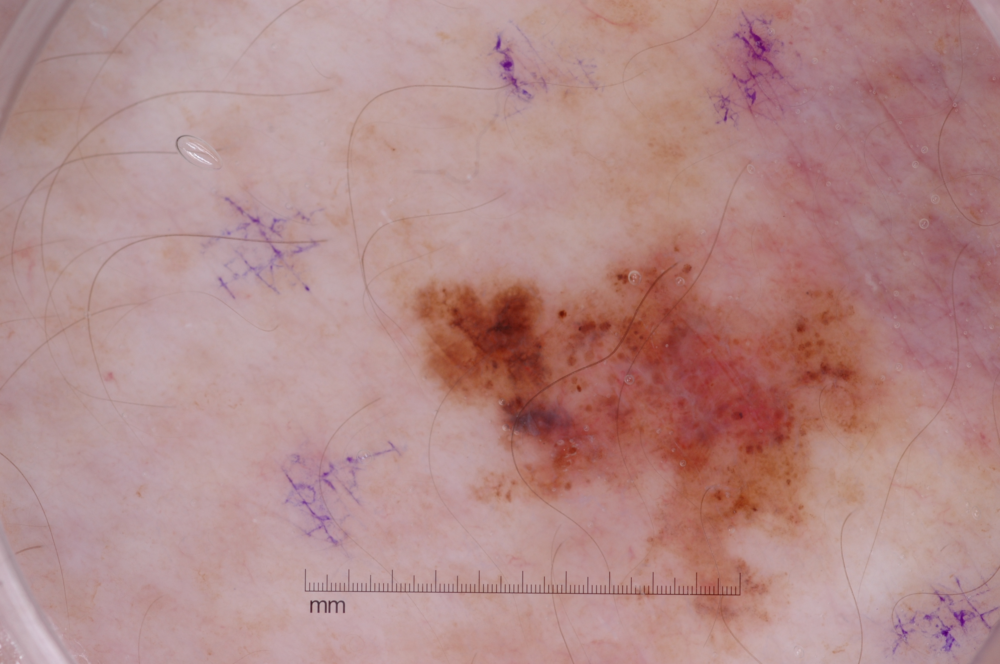

<h2>TensorflowSwinUNet-Image-Segmentation-Augmented-Skin-Cancer (2024/03/18)</h2>

This is the third experimental Image Segmentation project for Skin-Cancer  based on
the <a href="https://github.com/sarah-antillia/Tensorflow-Image-Segmentation-API">Tensorflow-Image-Segmentation-API</a>, and
<a href="https://drive.google.com/file/d/1kb7Tc9OSDQ28h83QKstXrhxMuKgWQb89/view?usp=sharing">Skin-Cancer-ImageMask-Dataset.zip</a>

 
 
Segmentation samples. 

 
 

We will use an online dataset augmentation strategy based on Python script <a href="./src/ImageMaskAugmentor.py">
ImageMaskAugmentor.py</a> to train aSkin-Cancer Segmentation Model.  

Please see also our first experiment <a href="https://github.com/sarah-antillia/Image-Segmentation-Skin-Lesion">Image-Segmentation-Skin-Lesion</a>
 based on a Pre-Augmented-ImageMask-Dataset of 256x256 pixel size.
 
, and our second experiment 
<a href="https://github.com/sarah-antillia/Tensorflow-Image-Segmentation-Augmented-Skin-Cancer">
Tensorflow-Image-Segmentation-Augmented-Skin-Cancer </a>
 

 
We use the Swin Transformer UNet Model
<a href="./src/TensorflowSwinUNet.py">TensorflowSwinUNet.py</a> for this Skin-Cancer Segmentation. 

On Swin Transformer UNet, please refer to <a href="https://arxiv.org/pdf/2105.05537.pdf">Swin-Unet: Unet-like Pure Transformer for Medical Image Segmentation</a> 

<h3>1. Dataset Citation</h3>
The image dataset used here has been taken from the following web site. 
<pre>
ISIC Challenge Datasets 2017
https://challenge.isic-archive.com/data/
</pre>

<b>Citing 2017 datasets:</b>
<pre>
Codella N, Gutman D, Celebi ME, Helba B, Marchetti MA, Dusza S, Kalloo A, Liopyris K, Mishra N, Kittler H, Halpern A.
 "Skin Lesion Analysis Toward Melanoma Detection: A Challenge at the 2017 International Symposium on Biomedical Imaging (ISBI),
  Hosted by the International Skin Imaging Collaboration (ISIC)". arXiv: 1710.05006 [cs.CV]
</pre>
<b>License: CC-0</b> 
 
See also: 

<a href="https://paperswithcode.com/dataset/isic-2017-task-1">ISIC 2017 Task 1</a> 
<pre>
Introduced by Codella et al. in Skin Lesion Analysis Toward Melanoma Detection: 
A Challenge at the 2017 International Symposium on Biomedical Imaging (ISBI), 
Hosted by the International Skin Imaging Collaboration (ISIC)
</pre>
<pre>
The ISIC 2017 dataset was published by the International Skin Imaging Collaboration (ISIC) as a large-scale dataset 
of dermoscopy images. The Task 1 challenge dataset for lesion segmentation contains 2,000 images for training with 
ground truth segmentations (2000 binary mask images).
</pre>
 
<h3>
<a id="2">
2 Skin-Cancer-ImageMask Dataset
</a>
</h3>
 If you would like to train this Skin-Cancer Segmentation model by yourself,
please download the dataset from the google drive 
<a href="https://drive.google.com/file/d/1kb7Tc9OSDQ28h83QKstXrhxMuKgWQb89/view?usp=sharing">
Skin-Cancer-ImageMask-Dataset.zip</a>
 

Please see also the <a href="https://github.com/sarah-antillia/ImageMask-Dataset-Skin-Cancer">ImageMask-Dataset-Skin-Cancer</a>. 
 
Please expand the downloaded ImageMaskDataset and place them under <b>./dataset</b> folder to be

<pre>
./dataset
└─Skin-Cancer
    ├─test
    │  ├─images
    │  └─masks
    ├─train
    │  ├─images
    │  └─masks
    └─valid
        ├─images
        └─masks
</pre>
 
 
<b>Skin-Cancer Dataset Statistics</b> 
 
As shown above, the number of images of train and valid dataset is not necessarily large. 
 

<h3>
<a id="3">
3 TensorflowSwinUNet
</a>
</h3>
This <a href="./src/TensorflowSwinUNet.py">TensorflowSwinUNet</a> model is slightly flexibly customizable by a configuration file. 
For example, <b>TensorflowSwinUNet/Skin-Cancer</b> model can be customizable
by using <a href="./projects/TensorflowSwinUNet/Skin-Cancer/train_eval_infer_augmentor.config">train_eval_infer_augmentor.config</a>
<pre>
; train_eval_infer.config
; 2024/03/18 (C) antillia.com

[model]
model          = "TensorflowSwinUNet"
generator      = True
image_width    = 512
image_height   = 512
activation     = "mish"
optimizer      = "Adam"

image_channels = 3
num_classes    = 1
;filter_num_begin = 128
filter_num_begin = 64

; number of channels in the first downsampling block; it is also the number of embedded dimensions

depth = 4
; the depth of SwinUNET; depth=4 means three down/upsampling levels and a bottom level 

stack_num_down = 2         
; number of Swin Transformers per downsampling level

stack_num_up = 2
; number of Swin Transformers per upsampling level

patch_size = (4, 4)        
; Extract 4-by-4 patches from the input image. Height and width of the patch must be equal.  

num_heads = [4, 8, 8, 8]   
;number of attention heads per down/upsampling level

window_size = [4, 2, 2, 2] 
;the size of attention window per down/upsampling level

num_mlp = 512              
; number of MLP nodes within the Transformer

shift_window=True          
;Apply window shifting, i.e., Swin-MSA

learning_rate  = 0.0001
clipvalue      = 0.5
loss           = "bce_dice_loss"
metrics        = ["binary_accuracy"]
show_summary   = False

[dataset]
datasetclass  = "ImageMaskDataset"
resize_interpolation = "cv2.INTER_CUBIC"

[train]
save_model_file = ""

; Enable splitting dataset into train and valid if True.
dataset_splitter = True
learning_rate_reducer = True
reducer_patience      = 5

epochs        = 100
batch_size    = 2
patience      = 10
metrics       = ["binary_accuracy", "val_binary_accuracy"]
;metrics       = ["iou_coef", "val_iou_coef"]
model_dir     = "./models"
eval_dir      = "./eval"

image_datapath = "../../../dataset/Skin-Cancer/train/images/"
mask_datapath  = "../../../dataset/Skin-Cancer/train/masks/"
create_backup  = False

[eval]
image_datapath = "../../../dataset/Skin-Cancer/valid/images/"
mask_datapath  = "../../../dataset/Skin-Cancer/valid/masks/"

[test]
image_datapath = "../../../dataset/Skin-Cancer/test/images/"
mask_datapath  = "../../../dataset/Skin-Cancer/test/masks/"

[infer] 
images_dir    = "./mini_test/images/" 
output_dir    = "./mini_test_output"
merged_dir    = "./mini_test_output_merged"

[mask]
blur        = True
binarize    = True
threshold   = 128

[generator]
debug        = True
augmentation = True

[augmentor]
vflip    = True
hflip    = True
rotation = True
angles   = [0, 90,180, 270]
shrinks  = [0.8]
shears   = [0.2]
transformer = True
alpah       = 1300
sigmoid     = 8
</pre>
Depending on these parameters in [augmentor] section, it will generate vflipped, hflipped, rotated, shrinked,
sheared, elastic-transformed images and masks
from the original images and masks in the folders specified by image_datapath and mask_datapath in 
[train] and [eval] sections. 
<pre>
[train]
image_datapath = "../../../dataset/Skin-Cancer/train/images/"
mask_datapath  = "../../../dataset/Skin-Cancer/train/masks/"
[eval]
image_datapath = "../../../dataset/Skin-Cancer/valid/images/"
mask_datapath  = "../../../dataset/Skin-Cancer/valid/masks/"
</pre>

For more detail on ImageMaskAugmentor.py, please refer to
<a href="https://github.com/sarah-antillia/Image-Segmentation-ImageMaskDataGenerator">
Image-Segmentation-ImageMaskDataGenerator.</a>.
    
 

<h3>
3.1 Training
</h3>
Please move to a <b>./projects/TensorflowSwinUNet/Skin-Cancer</b> folder, 
and run the following bat file to train TensorflowUNet model for Skin-Cancer. 
<pre>
./1.train_generator.bat
</pre>
, which simply runs <a href="./src/TensorflowUNetGeneratorTrainer.py">TensorflowUNetGeneratorTrainer.py </a>
in the following way.

<pre>
python ../../../src/TensorflowUNetGeneratorTrainer.py ./train_eval_infer_augmentor.config
</pre>
Train console output: 
 
Train metrics: 
 
Train losses: 
 
 
The following debug setting is helpful whether your parameters in [augmentor] section are good or not good.
<pre>
[generator]
debug     = True
</pre>
You can check the yielded images and mask files used in the actual train-eval process in the following folders under
<b>./projects/TensorflowSwinUNet/Skin-Cancer/</b>.  
<pre>
generated_images_dir
generated_masks_dir
</pre>

Sample images in generated_images_dir 
 
Sample masks in generated_masks_dir 
 

<h3>
3.2 Evaluation
</h3>
Please move to a <b>./projects/TensorflowSwinUNet/Skin-Cancer</b> folder, 
and run the following bat file to evaluate TensorflowUNet model for Skin-Cancer. 
<pre>
./2.evaluate.bat
</pre>
<pre>
python ../../../src/TensorflowUNetEvaluator.py ./train_eval_infer.config
</pre>
Evaluation console output: 

<pre>
Test loss    :0.2543
Test accuracy:0.9333000183105469
(py310-efficientdet) PS E:\unet-master\TensorflowSwinUNet-Image-Segmentation-Augmented-Skin-Cancer\projects\TensorflowSwinUNet\Skin-Cancer>

</pre>
<a href="https://github.com/sarah-antillia/Tensorflow-Image-Segmentation-Skin-Cancer">Tensorflow-Image-Segmentation-Skin-Cancer</a>
 
  

 
<h2>

 
<h2>
3.3 Inference
</h2>
Please move to a <b>./projects/TensorflowSwinUNet/Skin-Cancer</b> folder 
,and run the following bat file to infer segmentation regions for images by the Trained-TensorflowUNet model for Skin-Cancer. 
<pre>
./3.infer.bat
</pre>
<pre>
python ../../../src/TensorflowUNetInferencer.py ./train_eval_infer.config
</pre>
Please note that we use <a href="./projects/TensorflowSwinUNet/Skin-Cancer/mini_test">mini_test</a> dataset which
contains very large images, from 3K to 6.6K in width.  

mini_test images 
 
mini_test mask (ground_truth) 
 

 
Inferred test masks 
 
 
Merged test images and inferred masks  
  

Enlarged samples 
<table>
<tr>
<td>Input ISIC_0012223.jpg</td><td>Inferred-merged ISIC_0012223.jpg</td>
</tr>
<tr>
<td></td>
<td></td>
</tr>

<tr>
<td>Input ISIC_0012903.jpg</td><td>Inferred-merged ISIC_0012903.jpg</td>
</tr>
<tr>
<td></td>
<td></td>
</tr>

<tr>
<td>Input ISIC_0013948.jpg</td><td>Inferred-merged ISIC_0013948.jpg</td>
</tr>
<tr>
<td></td>
<td></td>
</tr>
<tr>
<td>Input ISIC_0014600.jpg</td><td>Inferred-merged ISIC_0014600.jpg</td>
</tr>
<tr>
<td></td>
<td></td>
</tr>

<tr>
<td>Input ISIC_0014693.jpg</td><td>Inferred-merged ISIC_0014693.jpg</td>
</tr>
<tr>
<td></td>
<td></td>
</tr>

</table>

 
 
<h3>
References
</h3>
<b>1. ISIC 2017 - Skin Lesion Analysis Towards Melanoma Detection</b> 
Matt Berseth 
<pre>
https://arxiv.org/ftp/arxiv/papers/1703/1703.00523.pdf
</pre>

<b>2. ISIC Challenge Datasets 2017</b> 
<pre>
https://challenge.isic-archive.com/data/
</pre>

<b>3. Skin Lesion Segmentation Using Deep Learning with Auxiliary Task</b> 
Lina LiuORCID,Ying Y. Tsui andMrinal Mandal 
<pre>
https://www.mdpi.com/2313-433X/7/4/67
</pre>

<b>4. Skin Lesion Segmentation from Dermoscopic Images Using Convolutional Neural Network</b> 
Kashan Zafar, Syed Omer Gilani, Asim Waris, Ali Ahmed, Mohsin Jamil,  
Muhammad Nasir Khan and Amer Sohail Kashif 
<pre>
https://www.mdpi.com/1424-8220/20/6/1601
</pre>

<b>5. Image-Segmentation-Skin-Lesion</b> 
Toshiyuki Arai @antillia.com
<pre>
https://github.com/sarah-antillia/Image-Segmentation-Skin-Lesion
</pre>

<b>6. ImageMask-Dataset-Skin-Cancer</b> 
Toshiyuki Arai @antillia.com
<pre>
https://github.com/sarah-antillia/ImageMask-Dataset-Skin-Cancer
</pre>
